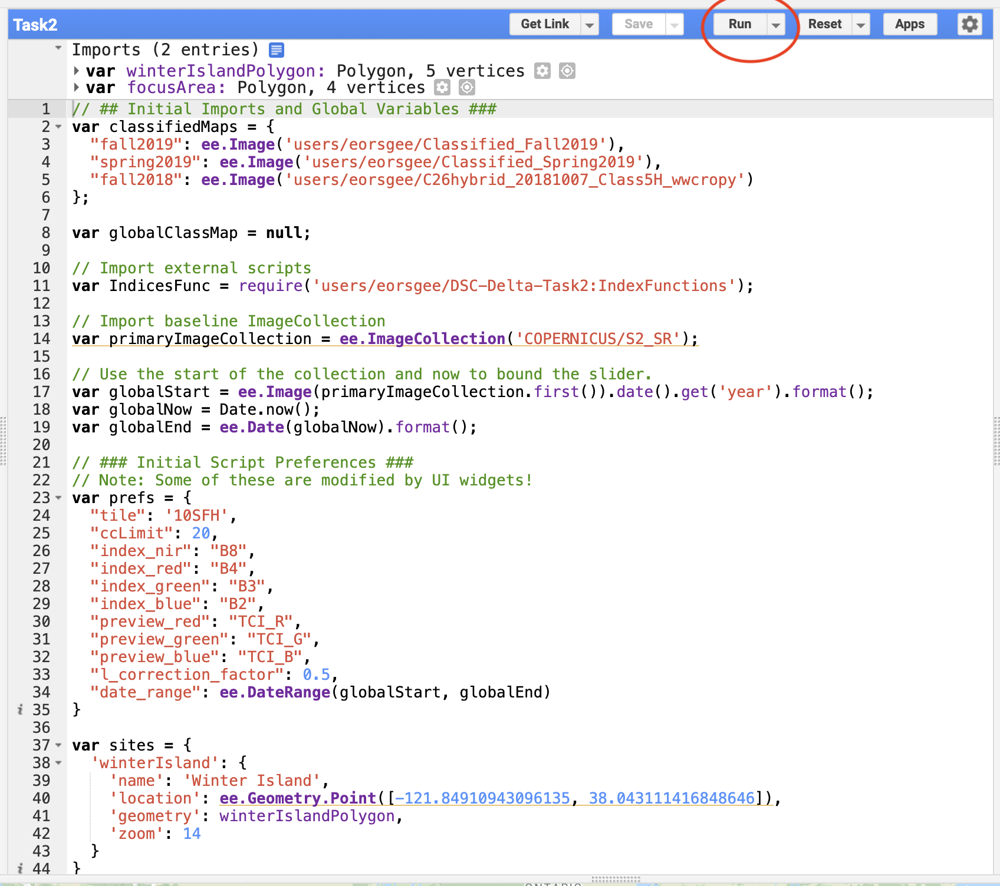
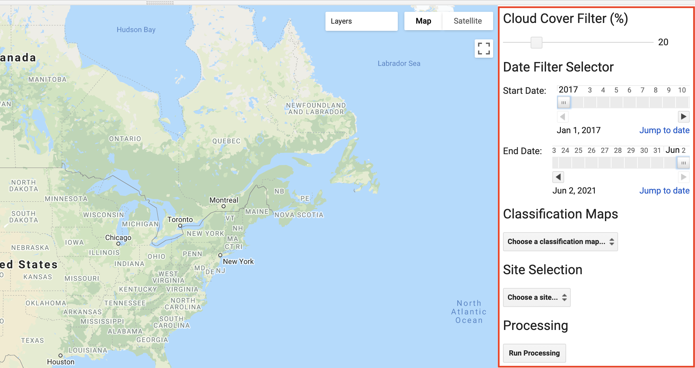

<div align="center">
    <h1>DSC Delta Task 2: Earth Engine Phenological Analysis and Time Series Processing</h1>
    <hr>
    A Google Earth Engine App that allows researchers to visualize Delta restoration site phenology alongside temporally aligned satellite imagery and index products. 
</div>


<p align="center">
    <a href="#key-features">Key Features</a> •
    <a href="#how-to-use">How to Use</a> •
    <a href="#warnings-tips-and-workarounds">Warnings, Tips, and Workarounds</a> •
    <a href="#the-user-interface">The User Interface</a> •
    <a href="#modification-of-the-code">Modification of the Code</a>
</p>

## Key Features

- Employs [Google Earth Engine's](https://earthengine.google.com/) JavaScript API
- Focused on [Sentinel-2 data](https://developers.google.com/earth-engine/datasets/catalog/COPERNICUS_S2_SR) from Earth Engine's extensive catalog
- Allows researchers to export time series tables for further analysis outside of the App

## How to Use

There are some steps that are important 

1. First, navigate to the Earth Engine scripting interface by visiting [https://code.earthengine.google.com](https://code.earthengine.google.com/) in your web browser.
    - *Make sure to sign in using your Google Earth Engine-enabled account!*
2. Find the `users/eorsgee/DSC-Delta-Task2` repository in the 'Scripts' tab. Open the `Task2` script.
    
3. Verify that the `prefs` object at line `23` of the script contains the correct values for your needs. If the object contains suitable values, it does not need to be changed. An example of a `prefs` object can be seen below:
    ```javascript
    var prefs = {
        "tile": '10SFH',            // The Sentinel-2 Tile to focus on
        "ccLimit": 20,              // Ignore; this can be set in the UI
        "index_nir": "B8",          // The Sentinel-2 band to be considered Near-Infrared (NIR)
        "index_red": "B4",          // The Sentinel-2 band to be considered Red
        "index_green": "B3",        // The Sentinel-2 band to be considered Green
        "index_blue": "B2",         // The Sentinel-2 band to be considered Blue
        "preview_red": "TCI_R",     // Preview imagery red band
        "preview_green": "TCI_G",   // Preview imagery green band
        "preview_blue": "TCI_B",    // Preview imagery blue band
        "l_correction_factor": 0.5, // Default "L correction factor" that the vegetation index algorithms will use
        "date_range": ee.DateRange(globalStart, globalEnd)  // Ignore; this can be set in the UI
    };
    ```
    
4. Click the "Run" button above the script text editor pane.
    
5. Using the UI that appears on the right side of the map pane, specify **cloud cover**, the **date range**, and the **target restoraion site**.
    
    - As dates and other parameters are changed using the UI, the preview imagery in the map pane will automatically be refreshed and updated.
    
6. Click the "Run Processing" button.
    
7. A chart visualizing the requested analysis will appear in the "console" tab.
    - To export a table, click on the boxed arrow in the top right corner of the chart.
8. The map preview will show the results of the calculated indices. 
    
9. Done!

### Adding Vegetation Indices
1. **Become familiar with the existing code and basic index subroutine requirements:**
   It can be helpful to understand how existing vegetation indices have been implemented before starting the process of writing new index subroutines. By default, all vegetation index code is stored in a separate "IndexFunctions" JavaScript file located in the same directory as the main "Task2" script. These functions are then imported into the "Task2" script using the `require` syntax provided by Google Earth Engine. All index calculating functions have a set of default values along with wrapper functions for ease of use when mapping across datasets. Note that these wrapper functions all prefixed with "apply", e.g. `applyNDVI`. These wrapper functions are called by the main processing routine of the "Task2" script. The simplest and easiest vegetation index calculation function is `calculateNDVI`. It can be used as a model for other vegetation index functions.
2. **Write your vegetation index calculation function:**
   It is recommended that your code be placed directly before the `indices` variable declaration. This avoids accidental scoping and variable initialization issues. 
   
   It can be helpful to insert a code section comment (e.g. "Custom Vegetation Index Functions" in the example image) to help separate your code from the rest of the code. An example of a soil-adjusted vegetation index implemented is shown below:
   
   ```javascript
   // ...
   
   // ### Custom Vegetation Index Functions ###
   var calculateSAVI = function(image, nirBandID, redBandID, L) {
     var savi = image.expression(
       '((NIR - RED) / (NIR + RED + L)) * (1 + L)', {
       'NIR': image.select(nirBandID),
       'RED': image.select(redBandID),
       'L': L
     });
     return image.addBands(savi.rename("SAVI"));
   }
   
   // ...
   ```
   Make sure to note the name of the calculated band included in the function output, in this case `"SAVI"`. This will be needed in a later step!
   
3. **Write function wrappers for your index functions:**
   The Google Earth Engine API requires that functions provided as arguments by `ImageCollection` mapping functions take only a single `Image` as input. Therefore, all the parameters required by the `calculateSAVI` function must be "pre-loaded" by a wrapper function. By using the global `prefs` variable, it is easy to make the index code generalizable to more sensors or situations.
   ```javascript
   // ...
   
   // ### Custom Vegetation Index Functions ###
   var calculateSAVI = function(image, nirBandID, redBandID, L) {
     var savi = image.expression(
       '((NIR - RED) / (NIR + RED + L)) * (1 + L)', {
       'NIR': image.select(nirBandID),
       'RED': image.select(redBandID),
       'L': L
     });
     return image.addBands(savi.rename("SAVI"));
   }
   
   // The apply function wrapper for calculateSAVI
   var applySAVI = function(image) {
     return calculateSAVI(image, prefs.index_nir, prefs.index_red, prefs.l_correction_factor);
   }
   
   // ...
   ```
4. **Register your functions with the processing system:**
   In order for the processing system to run your function, you must include your new index as an object entry in `indices`. This can be done by simply creating a new key-value pair where the value is an object containing two required components: the `name` and the `applyFunction`. The `applyFunction` must reference the wrapper for the index function that you wrote in the previous step.
   ```javascript
   // ...
   
   var indices = {
     // ...
     SAVI: {
       name: "SAVI",
       applyFunction: applySAVI,
     },
   };
   
   // ...
   ```
   *Note that the value associated with `name` (`"SAVI"`) is **exactly** the same as the name of the calculated band from step 2!
   
5. **Verify that your indices have been added by running the script:**
   To make sure that all the correct changes were made, run the script and use the UI to select the index you recently added.

## Warnings, Tips, and Workarounds
- Google Earth Engine aggressively rate-limits larger operations, especially those that involve running reduce operations using large vectors. To work around this issue, each restoration site analysis task should be run independently so as not to trigger the rate limiting.

## The User Interface
[TODO] Write docs or the UI

## Modification of the Code
[TODO] Write docs for the code

